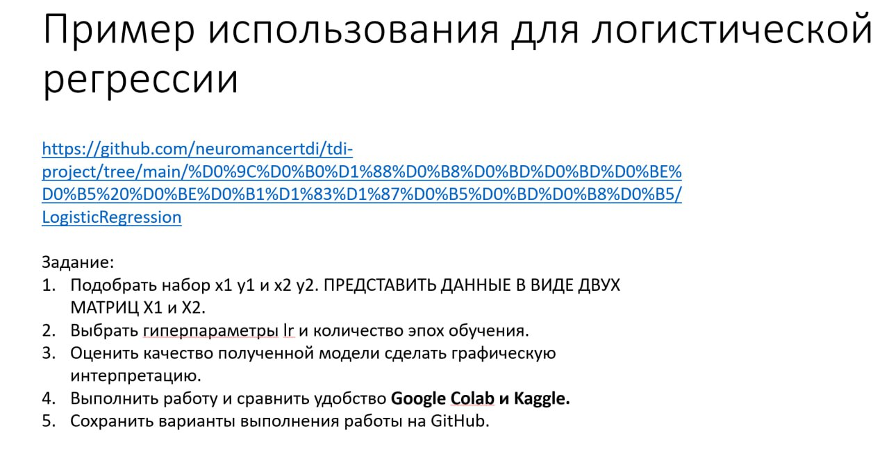
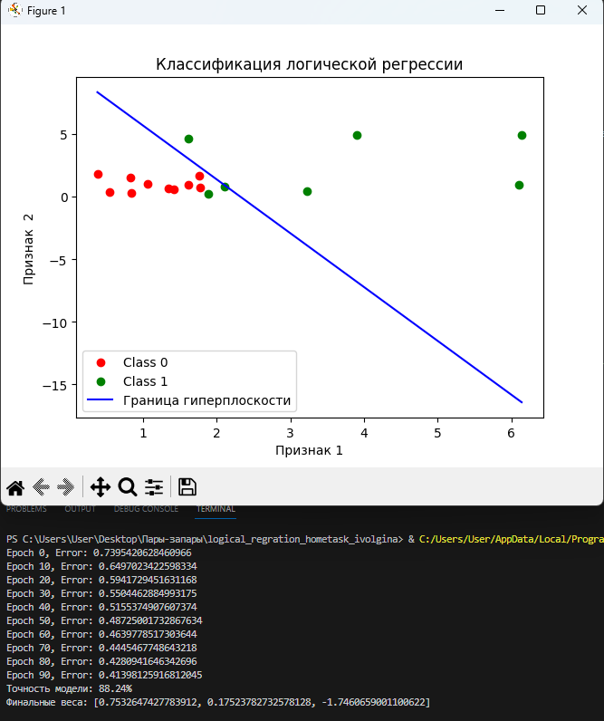
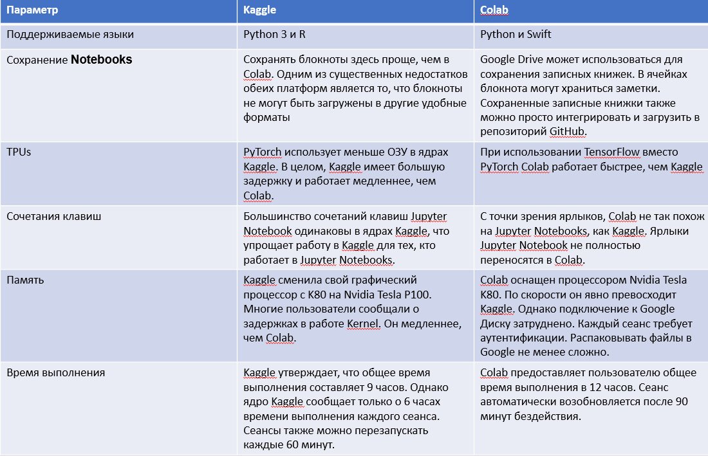
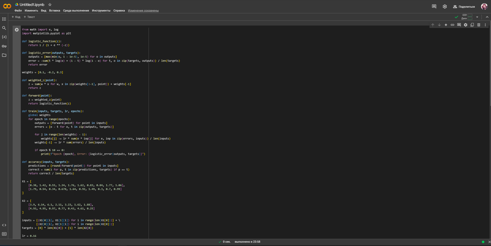
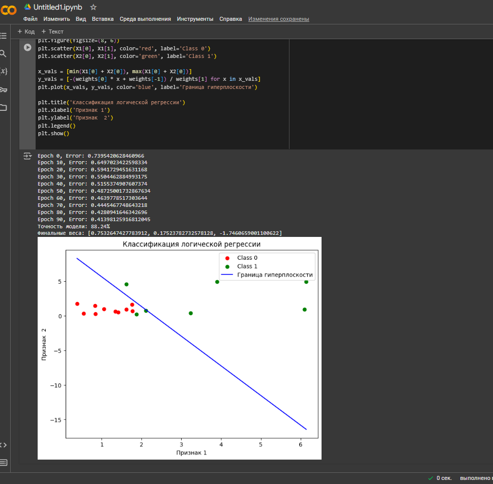
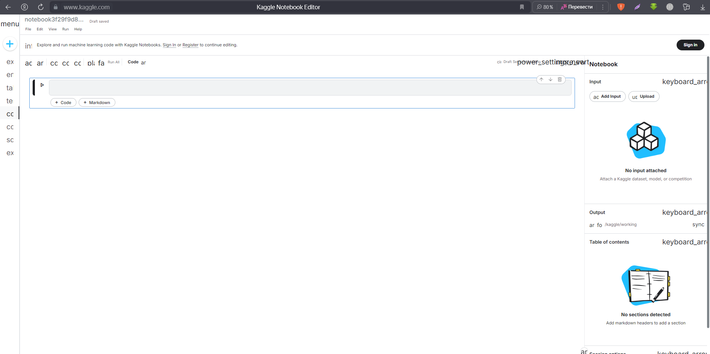
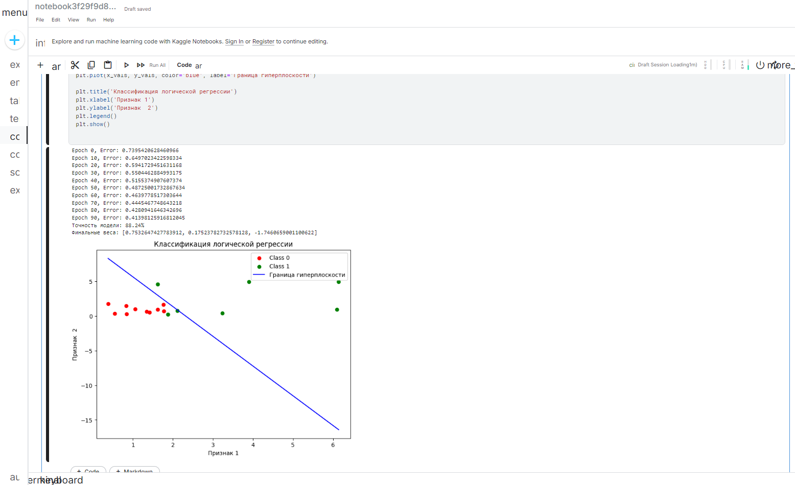

# Отчет к домашней работе
*Выполнила*: Иволгина Елизавета  
### Задание:
<center></center>  
 

**Полный код заданий 1-3 представлен в файле `homework.py`**   
1. Набор в виде матриц:
```
X1 = [
    [0.38, 1.42, 0.55, 1.34, 1.76, 1.62, 0.83, 0.84, 1.77, 1.06],  # x координаты
    [1.79, 0.54, 0.34, 0.678, 1.64, 0.92, 1.49, 0.3, 0.7, 0.99]   # y координаты
]

X2 = [
    [3.9, 6.14, 6.1, 2.11, 3.23, 1.62, 1.88],   # x координаты
    [4.93, 4.95, 0.97, 0.77, 0.43, 4.61, 0.25]  # y координаты
]
```
2. Заданные гиперпараметры:
```
lr = 0.16
num_epochs = 100
```
3. Оценка качества полученной модели
```
def accuracy(inputs, targets):
    predictions = [round(forward(point)) for point in inputs]
    correct = sum(1 for p, t in zip(predictions, targets) if p == t)
    return correct / len(targets)
...
model_accuracy = accuracy(inputs, targets)
print(f"Точность модели: {model_accuracy * 100:.2f}%")
print(f"Финальные веса: {weights}")
```
   Графическая интерпритация:
```
plt.figure(figsize=(8, 6))
plt.scatter(X1[0], X1[1], color='red', label='Class 0')
plt.scatter(X2[0], X2[1], color='green', label='Class 1')

x_vals = [min(X1[0] + X2[0]), max(X1[0] + X2[0])]
y_vals = [-(weights[0] * x + weights[-1]) / weights[1] for x in x_vals]
plt.plot(x_vals, y_vals, color='blue', label='Граница гиперплоскости')
```
При запуске кода получаем такую картину:

<center></center> 

4. Сравнение работы на Google Colab и Kaggle:  
   Таблица взятая из лекции:
   <center></center> 


### Google Colab
Начнем с Google Colab. Вход на сайт производится через аккаунт Google, можно открывать и загружать репозитории на свой Гугл Диск, GitHub или просто на устройство.
При входе сразу направляет на техническую литературу для работы с данным инструментом разработки.  
Для проверки работы создаем новый файл в Гугл Диск и в него загружаем написанный код. Так выглядит рабочая среда данного сайта:
<center></center> 
При запуске кода результат выводится под запускаемым кодом:
<center></center>

### Kaggle
Для работы с Kaggle даже не обязательна регистрация. Создается виртуальный блокнот и в нем уже можно прописывать код. Аналогично введем написанный ранее код и рассмотрим его вывод.
Интерфейс платформы схож с первой, рабочая среда Kaggle выглядит так:
<center></center>
Однако хоть визуально инструметы походи, код выполнялся заметно дольше, чем в GColab. 
<center></center>

### Итог
Обе платформы предоставляют удобные инструменты для написания, выполнения и анализа кода, и каждая имеет свои преимущества. Google Colab выделяется своей быстрой обработкой задач и привычным дизайном, что делает его более комфортным для пользователей.
Kaggle, в свою очередь, ориентирован на пользователей, работающих с задачами машинного обучения, и предоставляет мощные инструменты для анализа данных, такие как встроенные наборы данных и готовые к использованию GPU.
